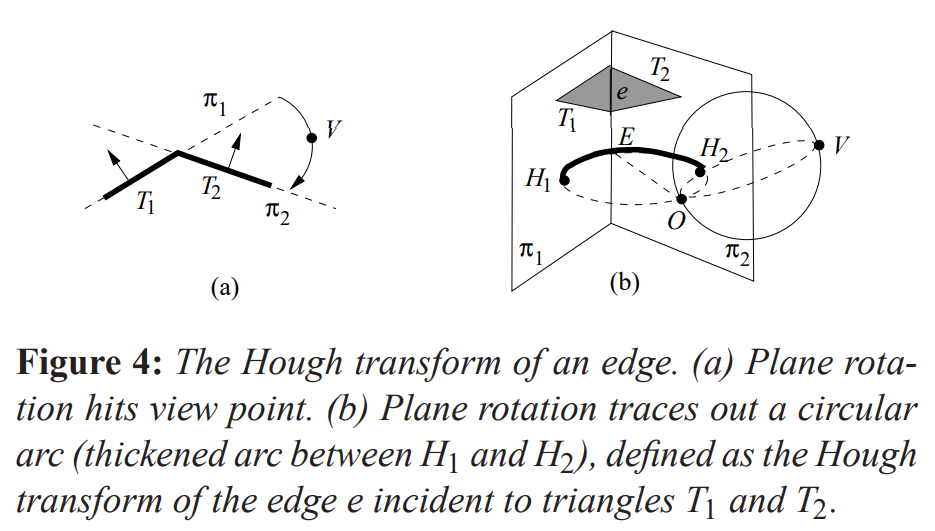

# Differentiable Computer Graphics - a beginner's perspective

罗志渊

[本文是作者情绪的宣泄, 有种怎么写也写不完的无力感, 同时水平和精力有限, 错漏之处, 烦请读者指正]

日常搬砖没有什么特别有意思的东西可以分享，但我不想浪费这次机会，这篇年度最佳的论文[differentiable visual computing](https://people.csail.mit.edu/tzumao/phdthesis/phdthesis.pdf)，至少对于我没见过机器学习的人来说，这类从未见过的方法，刷新了我的认知，觉得很有意思，所以就拿来分享给和我一样不懂机器学习和渲染的初学者。本文提到的一些按我自己理解写的源码可在我的[notebook](https://github.com/luozhiyuan/notebooks)中浏览(包含了AD, MC, MCMC, HMC, H2MC等演示代码)。

这里的内容称为Graphics是不太合适的, 并没有包含物理模拟等内容, 如果想了解Differentiable Graphics目前的工作, 可以继续参考[DiffTaiChi](https://arxiv.org/abs/1910.00935), 也是非常有意思的工作. 另一方面, 有很多基础知识还是有相通之处的, 只是应用场景的不同而导致一些独特的领域知识的差异.

## 内容

1. Automatic Differentiation (AD)

2. Monte Carlo (MC)

3. Markov Chain

4. Markov Chain Monte Carlo (MCMC)

   4.1 Metropolis-Hasting

   4.2 Hamiltonian Monte Carlo (HMC)

5. Path tracing and bidirectional path tracing

6. Metropolis light transport

7. Differentiable rendering

8. Hessian-Hamiltonian Monte Carlo ray tracing (H2MC)

9. *Path Integral

### Automatic Differentiation

假设我们都学过微积分， 那里面的内容大致可以分为微分和积分，这里介绍的是一种自动微分方法。

一阶微分算子$\cal D: f \rightarrow f'$是一个线性算子，经过适当的定义，线性代数中的一切结论都可以适用，这里就不展开了，二阶的$\cal D^2$就不是线性的了， 会有些麻烦， 后面会提到。

为了计算一个函数的微分： 
$$
f'(x) =\frac{d(f(x))}{dx} = \lim_{\Delta x\rightarrow 0}{ \frac {f(x+\Delta x)-f(x)}{\Delta x} }
$$


我们可以手动算极限，可以用符号运算计算，或者数值计算。

手动算初等函数组合而成的函数，我们可以人肉查下微分表，比如$d(e^x)/dx = e^x, d(\sin x)/dx = \cos x$，更复杂的我也记不住了 。

符号运算的话如下图让计算机根据微分法则（乘法法则和链式法则），查微分表。


数值方法的话就是利用定义让计算机去求极限：
$$
f'(x) \eqsim \frac{f(x+h) - f(x-h)}{2h}
$$
如$f(x) = e^x$,我们可以用上面的式子来近似算下$f'(0)=1$,

| h    | $(f(0+h)-f(0-h))/(2h)$ |
| ---- | ---------------------- |
| 1e-3 | 1.000000166666681      |
| 1e-4 | 1.00000000166689       |
| 1e-5 | 1.000000000012102      |
| 1e-6 | 0.9999999999732444     |
| 1e-7 | 0.9999999994736439     |

现实中，我们的函数会非常复杂，或者没有明确的表达式，有时候只有一个数据集到另一个数据集的映射。这里介绍一种精确的自动微分技术， 我们先定义一个二元数。

Dual Number：$a+b\epsilon, a\in \R, b\in \R, \epsilon \neq 0, \epsilon^2=0$。这个数有两部分组成，第一部分为这个数的值$a$，第二部分为一阶微分$b$。我们定义它的加减乘除形成一个域，使得它像普通的数一样参与计算。
$$
(a+b\epsilon)+(c+d\epsilon) = (a+c) + (b+d)\epsilon \\
(a+b\epsilon)(c+d\epsilon) = ac +(ad+bc)\epsilon \\
\frac{a+b\epsilon}{c+d\epsilon} = \frac{a}{c} + \frac{bc-ad}{c^2}\epsilon, c\neq 0
$$
对于实函数$f(x)$，我们定义
$$
f(a+b\epsilon) = f(a) + f'(a)b\epsilon
$$
这个定义是良好的（well defined），我们可以得到微分的乘法法则，和链式法则：
$$
f(x)=g(x)h(x) \rightarrow \\
\begin{align} 
f(a+b\epsilon) &= g(a+b\epsilon)h(a+b\epsilon) \\
&= (g(a) +g'(a)b\epsilon)(h(a)+h'(a)b\epsilon) \\
&= (g(a)h(a) + (g'(a)h(a) + g(a)h'(a))b\epsilon)
\end{align}\\
\rightarrow\\
f'(a) = g'(a)h(a)+g(a)h'(a)
$$

$$
f(x) = g(h(x)) \rightarrow \\
\begin{align}
f(a+b\epsilon) &= g(h(a+b\epsilon)) \\
&= g(h(a) + h'(a)b\epsilon) \\
&= g(h(a)) + g'(h(a))h'(a)b\epsilon
\end{align} \\
\rightarrow \\
f'(a) = g'(h(a))h'(a)
$$

以下自动微分的内容来自[How to Differentiate with a Computer](http://www.ams.org/publicoutreach/feature-column/fc-2017-12) 。

我们计算一元函数$f(x)=x\sin(x^2)$在$x=3$处的一阶导。这个函数的计算图（computation graph）如下：


由$f(3+\epsilon) = f(3) + f'(3)\epsilon$，我们可以算出$f'(3)$。
$$
\begin {align}
u &= x^2 \\
&= (3+\epsilon)^2\\
&= 9+6 \epsilon \\
v &= \sin(u) \\
&= \sin(9+6\epsilon) \\
&= \sin(9) + (\sin'(9))6\epsilon \\
&= \sin9 + 6 \cos(9) \epsilon \\
w &= x \sin(v) \\
&=(3+\epsilon)(\sin(9) + 6\cos(9)\epsilon)\\
&=3\sin(9) +(\sin(9)+18\cos(9))\epsilon \\
\rightarrow 
f'(3) &= \sin(9) + 18\cos(9)
\end {align}
$$
对于多元函数，我们同样可以算出偏导。比如对于$f(x,y,z)$， 我们可以用$f(x+\epsilon \bold{e_1},y+\epsilon \bold{e_2},z+\epsilon \bold{e_3})$求得梯度$[\partial f/\partial x,\partial f/\partial y,\partial f/\partial z]$。以$f(x,y,z)=xy\sin(yz)$在$(x,y,z)=(3,-1,2)$处的导数为例。该函数的计算图为


$$
\begin{align}
x &= 3+\epsilon[1,0,0]\\
y &= -1+\epsilon[0,1,0]\\
z &= 2 + \epsilon[0,0,1]\\
\rightarrow \\
t &= xy = -3 + \epsilon[-1,3,0] \\
u &= yz = -2 + \epsilon[0,2,-1] \\
v &= \sin(u) = \sin(-2) + \epsilon \cos(-2)[0,2,-1]\\
w &= tv = -3\sin(-2) + \epsilon[-\sin(-2), 3\sin(-2)-6\cos(-2),3\cos(-2)]\\
\rightarrow \\
f(3,-1,2) &= -3\sin(-2) \\
\nabla f(3,-1,2) &=[-\sin(-2), 3\sin(-2)-6\cos(-2), 3\cos(-2)]
\end{align}
$$
对于更高阶的如二阶以上的一元函数，需要引入更高阶的泰勒展开。我在[notebook](https://github.com/luozhiyuan/notebooks/blob/master/differentiable_number.hpp)实现了一个可以求三阶导的类，测试了$f(x)=x\sin(x^2)$：

```c++

template<int Order, typename Number>
DifferentiableNumber<Order, Number>
test_function(const DifferentiableNumber<Order, Number>& x)
{
	return x*Sin(Pow(x, 2));
}

{
   	auto x = DifferentiableNumber<3>(3);
	auto d = test_function(x);
	std::cout << "f(x) = " << d.Derivative(0) << std::endl;
	std::cout << "f'(x) = " << d.Derivative(1) << std::endl;
	std::cout << "f''(x) = " << d.Derivative(2) << std::endl;
	std::cout << "f'''(x) = " << d.Derivative(3) << std::endl; 
    //output:
    //f(x) = 1.23635545572527
    //f'(x) = -15.98822622868243
    //f''(x) = -60.90914112003389
    //f'''(x) = 495.9280353177431
}

```

同样对于多元函数，二阶的实现会变得比较复杂，参考[Hyper Dual Number](http://adl.stanford.edu/hyperdual/Fike_AIAA-2011-886.pdf)，引入运算法则：
$$
\begin{align}
a &= a_1+a_2\epsilon_1+a_3\epsilon_2+a_4\epsilon_1\epsilon_2 \\
b &= b_1+b_2\epsilon_1+b_3\epsilon_2+b_4\epsilon_1\epsilon_2 \\
\epsilon_1^2&=\epsilon_2^2=(\epsilon_1\epsilon_2)^2=0,\epsilon_1 \neq 0,\epsilon_2 \neq 0, \epsilon_1 \epsilon_2 \neq 0 \\
\\\space
a+b &= (a_1+b_1) + (a_2+b_2)\epsilon_1 + (a_3+b_3)\epsilon_2+(a_4+b_4)\epsilon_1\epsilon_2\\
a*b &= (a_1*b_1)+(a_1*b_2 +a_2*b_1)\epsilon_1+(a_1*b_3+a_3*b_1)\epsilon_2 +(a_1*b_4+a_2*b_3+a_3*b_2+a_4*b_1)\epsilon_1\epsilon_2 \\
\frac{1}{a} &= \frac{1}{a_1}-\frac{a_2}{a_1^2}\epsilon_1-\frac{a_3}{a_1^2}\epsilon_2+(\frac{2a_2a_3}{a_1^3}-\frac{a_4}{a_1^2})\epsilon_1\epsilon_2 \\
f(a) &= f(a_1)+a_2f'(a_1)\epsilon_1+a_3f'(a_1)\epsilon_2+(a_4f'(a_1)+a_2a_3f''(a_1))\epsilon_1\epsilon_2 \\
\bold{x} \in \R^n, \bold{x}&=[x_1,x_2,...,x_n]\\
\bold{x_{ij}} &= \bold{x}+h_1\epsilon_1\bold{e_i}+h_2\epsilon_2\bold{e_j} + \bold{0}\epsilon_1\epsilon_2 \\
f(\bold{x_{ij}}) &= f(\bold{x}) + h_1 \frac{\part f(\bold{x})}{\part x_i}\epsilon_1 + h_2 \frac{\part f(\bold{x})}{\part x_j}\epsilon_2 + h_1h_2\frac{\part^2 f(\bold{x})}{\part x_i \part x_j} \epsilon_1\epsilon_2
\end{align}
$$
其中$f(\bold{x_{ij}})$运行一次可以求出$x_i,x_j$ 的一阶导， 以及一个二阶导，后面我们会利用这个属性求出hessian matrix。我在[notebook](https://github.com/luozhiyuan/notebooks/blob/master/partial_differentiable_number.hpp)中写了一个，具体实现可见源码。对于本文和后面的内容来讲，二阶导已经足够。

以上称为前向自动微分(forward mode of automatic differentiation)。

对于很多机器学习任务来讲，$f:\R^m \rightarrow \R^n, m \gg n$，计算这样的函数的梯度，以上前向模式会显得低效。所以还有种通过求解线性方程组的反向自动微分（reverse mode of automatic differentiation）。

以上面$f(x,y,z)=xy\sin(yz)$为例，把中间变量前向（从下到上）算一遍得出这些中间变量的值$(x,y,z,t,u,v,w)$：


接下来我们引入伴随变量(adjoint variables)从上到下，反回来记录顶端节点对下面节点的偏导数（乘法法则与加法法则）：
$$
\begin{align}
\bar w &= \frac{\part w}{\part w}=1 \\
\bar v &= \frac{\part w}{\part v}= \frac{\part (tv)}{\part v} = t=-3 \\
\bar t &= \frac{\part w}{\part t}= \frac{\part (tv)}{\part t} = v= \sin(-2) \\
\bar u &= \frac{\part w}{\part u} = \frac{\part w}{\part v}\frac{\part v}{\part u}= \bar v \cos(u)=-3\cos(-2) \\
\bar x &= \frac{\part w}{\part x} = \frac{\part w}{\part t} \frac{\part t}{\part x} = \bar t y = -\sin(-2) \\
\bar y &= \frac{\part w}{\part y}= \frac{\part w}{\part t}\frac{\part t}{\part y} + \frac{\part w}{\part u}\frac{\part u}{\part y} = \bar t x + \bar u z = 3\sin(-2)-6\cos(-2) \\
\bar z &= \frac{\part w}{\part z}=\frac{\part w}{\part u} \frac{\part u}{\part z} = 3\cos(-2)
\end{align}
$$
最终我们求出了$f$关于$x,y,z$的偏导。在实现上，我们可以构造一个线性方程组($(x,y,z) = (3,-1,2)$)。
$$
\begin{align}
\bar x &= y \bar t=-\bar t\\
\bar y &= \bar t x + \bar u z = 3\bar t+2\bar u\\
\bar z &= \bar u \frac{\part u}{\part z} = y \bar u=-\bar u \\
\bar t &= \frac{\part w}{\part (tv)} \frac{\part (tv)}{\part t} =\bar w v \\
\bar u &= \bar v \cos(u) \\
\bar v &= \frac{\part w}{\part (tv)} \frac{\part (tv)}{\part v} = \bar w (-3)\\
\bar w &= 1
\end{align}
$$
由此得到一个稀疏的上三角阵 :
$$
\begin{pmatrix}
0 \\
0 \\
0 \\
0 \\
0 \\
0 \\
1 \\
\end{pmatrix}
=
\begin{pmatrix}
1 & 0 & 0 & 1 & 0 & 0 & 0 \\
0 & 1 & 0 & -3 & -2 & 0 & 0 \\
0 & 0 & 1 & 0 & 1 & 0 & 0 \\
0 & 0 & 0 & 1 & 0 & 0 & -v \\
0 & 0 & 0 & 0 & 1 & -\cos u & 0 \\
0 & 0 & 0 & 0 & 0 & 1 & 3 \\
0 & 0 & 0 & 0 & 0 & 0 & 1 \\
\end{pmatrix} 
\begin{pmatrix}
\bar x \\
\bar y \\
\bar z \\
\bar t  \\
\bar u \\
\bar v \\
\bar w
\end{pmatrix}
$$
求解以上线性方程即得$[\bar x, \bar y, \bar z]=[\part f/\part x, \part f/\part y, \part f/\part z]$。

假设我们学过数值计算，其中就有一个牛顿法，还有求最值的梯度下降法等，利用梯度可以求得一个函数的局部最小值。如果有了自动微分，这些就好办了，毕竟，数值微分，你要给一个多大的$\epsilon$才合适是很难讲的，学习率参数？调参？

以上自动微分是一个基本的知识，应用比较广泛，除了机器学习，如CFD，以及一些别的物理模拟系统中也会用到。

### Monte Carlo

由于平时工作从来没有接触过这类比较高端的话题，只记得十多年前翻过一本比较通俗易懂的书，所以以下包括后面MCMC和MCMC path tracing等内容主要参考自[PBR](http://www.pbr-book.org/)，也是我对之前读书内容的一个复习，有兴趣的建议直接读原版内容。

渲染的本质是重建信号：通过探测有限个点的信号，重建原始信号。因为我们的渲染的世界是连续的，无限的，所以这里自然要去采样，要使得重建出来的函数$\bar f$逼近真实函数$f$，或者我们说$E[\bar f]=f$。这里自然就引出了概率的内容，假设我们学过一点概率（我会做很多假设，不然就会导致些许只言片语演变成一本书）。

为了更好地理解这方面内容，避免一股脑儿涌过来的图形学术语的困扰，我把渲染抽象成一个函数，对于我的一个采样点它返回一个值。

考虑这样一个函数$f(x,y)= (1+\sin(x^2+y^2))/2$，我们假设自己一开始并不知道这个函数是啥（假装自己不知道他的解析形式，因为渲染函数是没有解析解的），但要在一个定义域范围内重建这个函数（$-512<x,y<512,0<w_i<1$），每给一个采样点，我们可以计算得到这个采样点上的值。

我们先偷看下真实的函数图像（ground truth）：


蒙特卡洛积分:

欲求此式
$$
I = \int_{\Omega} f(x)d\Omega
$$
需采样此函数
$$
I\simeq \frac{1}{N}\sum_{i=1}^{N} \frac{f(x_i)}{p(x_i)}
$$
$N$为采样数, $p(x_i)$为概率密度函数(PDF). 上式以概率为1趋向于期望值. 收敛速度是$O(\sqrt{N})$, 比如增加1倍的样本, 误差减小$1/\sqrt{2}$. 这个式子本质上是一种加权平均. 举个最简单的例子, 设$x$在$[a,b]$上均匀分布, 那么每个点的权重都相等($p(x)=1/(b-a)$), 我们可以用:
$$
I\simeq \frac{b-a}{N}\sum_{i=1}^{N} f(x_i)
$$
或者,可以这样理解, 在$[a,b]$上, $N \rightarrow \infty$个采样点的平均值趋向于$f$的平均值, 积分就是求面积, 所以面积=区间大小$\times$均值.

inversion method

rejection method

### Markov Chain


### Markov Chain Monte Carlo 


#### Metropolis-Hasting

#### Hamiltonian Monte Carlo


### Path tracing and bidirectional path tracing

### Metropolis light transport

### Differentiable rendering

这里的内容来自于论文[Differentiable Monte Carlo Ray Tracing through Edge Sampling](https://people.csail.mit.edu/tzumao/diffrt/).

这里考虑这样一个问题，比如有一个摄影师拍照，他心中有一些“算法模型，让模特摆个大概的姿势，灯光大概的方向，然后自己找个大概的角度，接下来他要不断看相机里的“结果”，微调以上“参数”，直到在照相机里看到自己想要的“最优”的图片。这个过程就是一个“Differentiable Rendering”的过程。或者我们将它称为Inverse Rendering。只是现在我们有一张目标图片，如何调整我场景里的各种参数：比如摄像机的位置，角度，生成合适的三角面片，灯光方向等，最后接近或者达到目标图片的效果。

我们有生成图片的一些现成的算法模型去生成图片，如路径跟踪，基于物理的材质模型，在这些成熟的前向渲染的算法框架里，如前向自动微分，我们的目标函数对所有参数求导，来做一个梯度下降。

但这里有个难点，我们做微分的目标函数往往是连续的，而相对于场景变化，我们的图片结果可能是不连续的。其实是渲染方程中的可见性项（visibility term）引发的问题。考虑某个像素，恰好在白色三角形的边缘，而它背后是黑色的，那么相对于他的顶点变化，我们这个像素会产生突变，黑色到白色的突变，当然不只是颜色，这个像素对应的所有属性都发生了突变，比如shading相关的材质，几何信息都完全不一样。边缘像素相对这些参数求导，就相当于对一个阶跃函数(step function)进行求导，数学上是需要有特殊的处理的。

基于以上原因，我们假设在场景里没有纯点光，没有纯镜面，这些东西的采样分布都是一个$\delta$函数，但可以用比较小的面光，比较光滑的glossy surface来模拟。

对于visibility的问题，需要分离边缘的情况，单独考虑，下面我们从一个像素说起。

对于渲染过程（也就是摄影师怎么得到他预览的那张图片的过程），我们用path integral求一个积分，采用的方法是path tracing。

对于一个像素的颜色$I$，是由无数这个像素上的点贡献的：
$$
I = \int\int f(x,y)dxdy
$$
$f(x,y)$为一次path tracing的贡献（一次path tracing的结果$\times$权重）。而对于一组我们感兴趣的一些参数$\Phi$（比如摄像机的位置，mesh顶点的位置）来说，我们的函数可以写成$f(x,y;\Phi)$，这个像素相对这个参数的变化率（梯度）为：
$$
\nabla I = \nabla \int\int f(x,y;\Phi)dxdy
$$
用Monte Carlo方法求$I$,可以得到
$$
I \simeq \frac{1}{N}\Sigma f(x_i,y_j;\Phi)
$$
$x,y$分别是屏幕空间的采样点，$N$为采样总数。

省略场景参数，我们把$f$看成是函数在屏幕空间的取值。三角形的一条边将我们的屏幕空间分成上下两半($f_u,f_l$)，设这条边的直线方程为$\alpha(x,y)$。而我们的$f$可以由上下两半以及这条边表示：
$$
\theta(x)=\left\{ 
\begin{array}{ll}
0 & \mbox{x < 0};\\
\frac{1}{2} &\mbox{x = 0};\\
1 & \mbox{x>0};
\end{array}\right. \\
f(x,y)=\theta(\alpha(x,y))f_u(x,y) + \theta(-\alpha(x,y))f_l(x,y)
$$
$\theta$称为Heaviside step function(它的“导数”是狄拉克$\delta$函数)，当直线$\alpha$在某个三角形内部时，也能得到正确的结果此时$f=f_u=f_l$。


在调整场景参数（比如改变三角形的位置或摄像机参数）的时候屏幕中这条边的顶点会发生偏移，从而影响最后的渲染结果。所以我们可以先求出相对于这两个顶点的偏导。

设某条边的两个顶点在屏幕中的坐标为$(a_x, a_y),(b_x,b_y)$，我们边上的点为下面这个多项式的零点：
$$
\alpha(x,y) = (a_y-b_y)x + (b_x-a_x)y+(a_xb_y- b_xa_y)
$$
$\alpha(x,y)>0$表示在边的上方，$\alpha(x,y)<0$表示在下面。

我们的场景函数（把像素坐标映射到颜色的函数）$f$可以用一系列边表示出来，每条边都切割了屏幕，分成两个函数，把所有的这些函数记为$f_i$，加起来
$$
\int\int f(x,y)dxdy = \int\int \sum_{i} \theta(\alpha_i(x,y))f_i(x,y)dxdy = \sum_{i}\int\int \theta(\alpha_i(x,y))f_i(x,y)dxdy
$$
$f_i$内部可能也包含了$\theta$，如一个三角形就由三个$\theta$相乘而得（三角形内部的点都在边的同一侧 $>0$）。

至此，我们要算的梯度，就是对$f$求微分，对上述和中的每一项求微分(乘法法则/链式法则):
$$
\begin{align}
\nabla \int\int\theta(\alpha_i(x,y))f_i(x,y)dxdy &= \int\int \delta(\alpha_i(x,y))\nabla\alpha_i(x,y)f_i(x,y)dxdy \\ &+ \int\int  \nabla f_i(x,y)\theta(\alpha_i(x,y))dxdy
\end{align}
$$
以上，我们可以将积分变成在边上的部分（$\delta$）积分，和对原始函数的梯度部分（$f_i$并不考虑边上的不连续性）的积分。我们用Monte Carlo法估计上述两个积分。采样时后半部分即$f_i$梯度可以通过自动微分来累加平均求得。接下来需要处理的是前半部分($\delta$)函数的 Monte Carlo采样，这是这片论文的一个突破点。

做积分变换， 区域的积分变成了线上的取值的积分：
$$
\int\int\delta(\alpha_i(x,y))\nabla\alpha_i(x,y)f_i(x,y)dxdy = \int_{\alpha_i(x,y)=0}\frac{\nabla\alpha_i(x,y)}{\mid\mid \nabla_{x,y}\alpha_i(x,y) \mid\mid}f_i(x,y)d\sigma(x,y)
$$
其中，$\mid\mid\nabla_{x,y}\alpha_i(x,y)\mid\mid$是边的长度，考虑了雅克比行列式。$\delta(x,y)$是变换后的测度。这里的数学变换我还没有完全理解,但可以参考下微分方程方面的资料.

$\alpha_i$的关于各种参数变化的梯度如下(主要由直线方程得到)：
$$
\frac{\part \alpha_i}{\part a_x}=b_y -y,\frac{\part \alpha_i}{\part a_y} = x-b_x\\
\frac{\part \alpha_i}{\part b_x}=y-a_y,\frac{\part \alpha_i}{\part b_y}=a_x-x\\
\frac{\part \alpha_i}{\part x} = a_y-b_y,\frac{\part \alpha_i}{\part y}=b_x-a_x \\
\mid\mid\nabla_{x,y}\alpha_i\mid\mid = sqrt(dot((\frac{\part \alpha_i}{\part x},\frac{\part \alpha_i}{\part y}),(\frac{\part \alpha_i}{\part x},\frac{\part \alpha_i}{\part y}))) =\sqrt{(a_x-b_x)^2+(a_y-b_y)^2}\\
$$
对于相对于别的参数变化梯度，我们可以用链式法则(边的顶点的相对这个参数的变化,这个变化率是可以通过自动微分的方式得到的)来得到，比如对于参数$p$(比如相机参数, mesh顶点,法线):
$$
\frac{\part \alpha}{\part p} = \frac{\part \alpha}{\part a_x}\frac{\part a_x}{\part p}+\frac{\part \alpha}{\part b_x}\frac{\part b_x}{\part p}+\frac{\part \alpha}{\part a_y}\frac{\part a_y}{\part p} + \frac{\part \alpha}{\part b_y}\frac{\part b_y}{\part p}
$$
接下来就可以在边上使用monte carlo了:
$$
\frac{1}{N}\sum_{j=1}^{N}\frac{\mid\mid E\mid\mid}{P(E)}\frac{\nabla\alpha_i(x_j,y_j)(f_u(x_j,y_j)-f_l(x_j,y_j))}{\mid\mid \nabla_{x_j,y_j}\alpha_i(x_j,y_j)\mid\mid}
$$
对比积分, 我们多了$E$, 其中$\mid\mid E \mid\mid$为边的长度, $P(E)$为选择该条边的概率.

在具体采样中, 对于大部分边其实是比较连续, 比如mesh上的法线一般不会发生剧烈变化. 只有某些比较特征性的描边才需要采样. 比如屏幕空间的中的物体边缘, 或者深度/法线发生剧烈变化的边. 最终效果如下: 

目标需要达到的遮挡关系:


初始配置:


自动调整过程:

<video src=".\video\two_triangles.mp4"></video>


以上只是处理了屏幕上的遮挡关系, 我们可以用类似的方法处理阴影这些对光源的遮挡关系.


如上图所示, $p$点是我们path tracing需要求光照的一个点, 被blocker挡住了light source的一部分. 这个blocker的有边$(v_0,v_1)$, 与$p$点形成一个面, 这个面将场景切割为两部分$h_u, h_l$, 这个切割面像前面的边一样, 引入了不连续的因素, 所以自然地,  就在这个面上引入一个heaviside step function, 然后一路类推使得我们能在面上进行Monte Carlo采样.

我们最终要求$p$的颜色计算(shading)相对于场景各参数(摄像机等)的梯度. 这里用$g(p)$来表示这个点的颜色. 而把场景空间中的所有点的集合记为$\cal M$(流形), 这个点的颜色是被场景中的所有点影响, 所以这里自然有个$p$和场景中所有点$m$的关系的积分.
$$
 g(p) = \int_{\cal M} h(p,m)dA(m)
$$
$A(m)$是$m$点的无穷小面(面积测度), $h$是一个关于场景的函数, 包括材质的影响, 法线, $m$照亮$p$的间接光, 可见性等. $g$是之前屏幕空间$f$在路径上遇到的一个点, 所以我们对$f$用自动微分求梯度的时候, 自然而然地收到了$g$的影响(链式法则).

类似边的处理,我们有:
$$
h(p,m) = \theta(\alpha(p,m))h_u(p,m) + \theta(-\alpha(p,m))h_l(p,m)
$$
$v_0,v_1,p$形成了一个有(法)向的面, 所以面方程$\alpha$可以告诉我们点$m$在这个面的前(正)面(>0)还是后(反)面(<0), 恰好在面里面(=0).
$$
\alpha ( p,m)=(m-p)\cdot(v_0-p)\times(v_1-p)
$$
类似前面对屏幕上边的处理, 我们主要考虑面上的点($\delta(\alpha(p,m))=1$), 最后有如下形式:
$$
\int_{\alpha(p,m)=0} \frac{\nabla\alpha(p,m)}{\mid\mid \nabla_m\alpha(p,m) \mid\mid} h(p,m) \frac{1}{\mid\mid n_m\times n_h \mid\mid} d\sigma'(m) \\
n_h = \frac{(v_0-p)\times(v_1-p)}{\mid\mid (v_0-p)\times(v_1-p) \mid\mid}
$$
与屏幕上的边有几个不同之处: 1. 我们积分的线是把边$(v_0, v_1)$, 通过$p$投影到场景上的那条线,如前面图((a) second visibility) 中的半透明的三角形,与场景相交的那条线(图上是光源); 2. 这里多了个修正项$\mid\mid n_m\times n_h \mid\mid$, 需要看前面的图((b) width correction), $m$就是$(v_0,v_1)$投影到黄色面光源上的一个点,  $m$在面的交线上, 所属两个面$(v_0,v_1,p)$与黄色的场景面(光源)分别有两个法线对应$n_h,n_m$, 而我们的采样点在$(v_0,v_1)$这条边上, 这条边有无穷小的厚度(宽度)-也就是面的有一个无穷小的厚度, 将这个厚度投影到场景面上, 我们得到$(v_0, v_1)$的厚度与$m$所在直线的厚度的比率:$1 /\sin\theta, (\sin\theta = \mid\mid n_m\times n_h) \mid\mid$. 在一条边上采样相当于在一个宽度为无穷小的一个面上采样(后面会提到$(v_0,v_1)$上的采样点是通过将这条边扩展为一个面向跟踪光线的billboard得到的).

我们把边参数化(我们采样时就采样个$[0,1]$之间的随机数就可以了):$v_0+t(v_1-v_0)$. 投影点$m$就是一个关于$t$的函数, 做个积分变换:
$$
\int_0^1 \frac{\nabla\alpha(p,m(t))}{\mid\mid\nabla_m \alpha(p,m(t)) \mid\mid}h(p,m(t))\frac{\mid\mid J_m(t) \mid\mid}{\mid\mid n_m\times n_h \mid\mid}dt
$$
其中雅克比项$J_m(t)$是个三维向量, 描述了$m$所在的这条交线上的点$m(t)$是如何随着参数$t$变化的(可以参考图中的一些几何关系:投影到$n_m$上形成一个相似三角形,然后根据比例关系得到. $\omega(t)$为包含长度的方向向量,$\tau(t)$为比率):
$$
\omega(t) = v_0 + (v_1-v_0)t -p\\
\tau(t) = \frac{(m(t)-p)\cdot n_m}{\omega(t)\cdot n_m}\\
m(t)=\tau(t)\omega(t)\\
\rightarrow\\
J_m(t)=\frac{\part m(t)}{\part t} = \tau(t)\left((v_1-v_0)-\omega(t)\frac{(v_1-v_0)\cdot n_m}{\omega(t)\cdot n_m}\right)
$$
对于积分中$\nabla \alpha$, 我们得到相对于边顶点的坐标和$p$点的变化率:
$$
v_0' = v_0-p, v_1'=v_1-p,m'=m-p\\
\mid\mid \nabla_m \alpha(p,m) \mid\mid = \mid\mid v_0'\times v_1' \mid\mid \\
\nabla_{v_0}\alpha(p,m) = v_1'\times m' \\
\nabla_{v_1}\alpha(p,m) = m' \times v_0' \\
\nabla_p\alpha(p,m) = v_0' \times v_1' + m'\times v_1' + v_0'\times m'
$$
以上导出了在在边上积分的梯度公式, 接下来就是Monte Carlo 采样求积分, 通过自动微分求出梯度. 

可以看下这个例子, 注意阴影的变化:

目标:


初始:


自动微分梯度过程:

<video src="./video/bunny.mp4"></video>

接下来要做的工作是需要具备一定知识量和工程量的, 涉及多个知识点. 这里只挑重点说, 可能对搞图形的同学们来说基本上都是炒冷饭.

我们需要定义一个重要度采样(importance sampling)的PDF($p(x_i)$). 上面我们会有大量的边出现, 那么自然而然我们需要有一种方法让我们选取一条边; 其次, 需要尽量选取贡献比较大的点.

对于屏幕空间(primary visibility)上的边, 我们可以基于边的长度作为重要度指标(权重), 选取一条边, 然后均匀的在边上取点.

对于场景中的影响场景光源(或间接光)可见性(secondary visibility)的遮挡物(blocker)的边, 需要更复杂一些:首先建立一种树状层级结构(比如按空间划分), 采样边是也要考虑当前$p$点的材质对边所在方向的以及边上的材质的影响, 而在边上取点时, 把边扩展成一个比较狭长的billboard, 面向next event estimation(有个优化:pathtracing路径上的每个点都会检测一下是否被光源照亮, 这时就要多发射一次光线)的光线求交, 将交点投影到边上而得到.以下简要讲下几个关键词.

1. 如何选取一条边, 方法类似many light. 多光源一直是噩梦, 成千上万个光源, 对每个path都会造成影响,如果都去遍历一遍,性能直接除以光源数. 面对多光源,我们只能挑重点光源(比如特别亮, 影响力特别大), 就像人多了以后, 芸芸众生, 多数平凡, 多一个少一个都差不多, 只有那些重要的人物才能有重要的影响, 我们定义一个重要度, 把重要的人选出来好好对待就差不多了. 场景大量三角形, 大量的边, 选取的时候我们需要按它的长度, 材质属性等定义好重要度, 建立如下图所示的层级结构(紧邻的边可能会形成一个cluster), 基本上就定义了一个分布的CDF, 我们随机一个数, 遍历层级结构, 最后能选中一个边, 越重要的边你可能选中的机会也多.

   

   

   

2. [Silhouette Extraction in Hough Space](https://www2.cs.sfu.ca/~haoz/pubs/olson_zhang_eg06.pdf). 这个方法是对偶性的妙用. 二维的Hough Transform, 是把一个点对应到Hough space的一条正余弦叠加的曲线(这条曲线能表示过这个点的所有直线), 对不同曲线的交点计数, 有交点的曲线逆映射到原空间, 对应的点共线.

               

          

   三维的面的情况一样, 把$\rho$看为三角形所在面到原点的距离, 相同距离的面共面,就不会形成描边. 由此我们在hough空间中可以用一个点来表示一个面.

   

   上图中, 经过V点的球(v-sphere), 如果两个相邻三角形一个在hough 空间中对应的两个点一个在球里面,一个在球外面,那么他们的边就是一个我们需要的轮廓边. 还有两个定理一个推论:1. hough space中过原点的边是轮廓边. 2. 如果不过原点, 则该边为轮廓边当且仅当轮廓边在hough space与v-sphere相切.  这片文章还蛮有意思的, 有兴趣的可以详细看看.

   

   3. 材质上使用LTC(linearly transformed cosines). 这是用三角函数逼近BRDF函数的方法, 作为一个采样边的重要度. 具体可参见[Real-Time Polygonal-Light Shading with Linearly Transformed Cosines](https://blogs.unity3d.com/2016/05/26/real-time-polygonal-light-shading-with-linearly-transformed-cosines/)


这里只是蜻蜓点水, 具体实现有兴趣的可以看作者源码. 

以上主要是这篇论文的基本脉络, 对于完全的新手来说，这篇论文的知识量还是比较大的，对于实现来讲，从头撸一遍，也是不小的工程量，发个siggraph不容易。图形渲染在工程上一向"臭名昭著”，有的看起来很简单三言两语就能讲个大概了，但数学上要搞对，实现上没bug是很难的(比如vertex connection and merging(vcm)；unifying points, beams, paths(upbp))。半天渲一张，调试就抓狂。不过一个领域的成熟，往往是从一开始偏向智力技巧，变成智力和体力并重，最终大量教程和工具的出现，变成体力活。

话说回来, 这篇论文没考虑光线传播介质的影响, 如果对differentiable rendering有更多的兴趣, 可以继续学习以下两篇论文, 基本上可以认为是现在(2020年)为止最前沿的研究了(state of the art):

[A First-Order Analysis of Lighting, Shading, and Shadows](https://cseweb.ucsd.edu/~ravir/papers/firstorder/gradient.pdf)

[A Differential Theory of Radiative Transfer](https://dl.acm.org/doi/10.1145/3355089.3356522) [源码](https://github.com/uci-rendering/dtrt)


### Hessian-Hamiltonian Monte Carlo ray tracing

通常用高斯分布来做为hasting term， 图形学里的anistropic的材质， 在x，y两个方向上是分布不均匀的， 我们用二维高斯来拟合，而gradient，反映了这两个方向上的变化率，进一步的反映二阶导的hessian 矩阵可以引导我们采样的方向。比如牛顿法。

接下来我们继续这篇博士论文, 这部分主要来自[Anisotropic Gaussian Mutations for Metropolis Light Transport through Hessian-Hamiltonian Dynamics](https://people.csail.mit.edu/tzumao/h2mc/), 讲的是传统的图形学知识: 如何用光线跟踪渲染图片. 一下大部分内容是论文关键内容的翻译抄写.

对光路复杂的场景, 一般方法收敛得很慢. 所谓difficult light path, 基本上都是光线经过各种specular/glossy表面产生的各种令人目眩的效果.


以下图焦散效果为例, 我们希望采样分布尽可能地符合亮度的分布, 比如在亮的地方有更多地采样数. 我们可以把亮度函数定义为我们的目标函数.


这片论文的主要贡献是对Markov Monte Carlo这类渲染方法做了改进, 就是这论文中的两张图示, 图(a)中凸起的部分可以看成是上述圆环中光线聚焦的部分:


我们主要看论文中的图4. 主要意思是我们对目标函数取了-log之后, 在目标函数表面上模拟哈密顿动力系统, 而在目标函数的局部区域我们可以用二次逼近, 对动量的随机采样采用高斯分布, 还用了一个高斯分布作为先验分布, 防止跑太远, 太远了我们的二次逼近就不准了.

直观上生成下一个状态过程如下:

<video src="./video/h2mc.mp4"></video>


最终结果如下:


前面我们提到Hamiltonian Monte Carlo需要模拟动量到达下一个状态, 而模拟的过程需要符合Hamiltonian方程, 就是个数值积分的过程, 而数值积分就是对每一个步长函数求值累加, 对于我们的path tracing来说, 一次函数求值就是一次路径跟踪, 这是很要命的, 模拟一次粒子运动要做几十几百个path tracing才能到下一个状态点, 必然慢的要死. 所以我们把目光转向近似的解析解.

由前面HMC的介绍, 我们将我们的路径跟踪函数$f(\bold{x})$作为目标分布函数, 取$log$做二阶近似(泰勒展开):
$$
\log f(\bold {x}+\Delta \bold {x})\simeq \frac{1}{2} {\Delta\bold{x}}^TH{\Delta\bold{x}} + G^T \Delta \bold{x}+\log f(\bold{x})
$$
其中$H$是Hessian矩阵, $G$是梯度向量.

这里重复一下含有HMC部分提到带质量矩阵的hamiltonian方程:
$$
\frac{\part \bold x}{\part t} = A p\\
\frac{\part p}{\part t} = \frac{\part \log f(\bold x)}{\part \bold x} \\
\frac{\part^2 \bold x(t)}{\part t^2} = \frac{\part (Ap)}{\part t} = A \frac{\part \log f(\bold x)}{\part \bold x} \simeq A H \bold{x} +AG
$$
上面我们得到一个标准的二阶微分方程, 这种形式是有解析解的. 比如在一维情况下令$\alpha = AH, \beta = AG$, 解析解为:
$$
x(t)= \left\{
\begin{array}{eq} 
c_1 \exp(\sqrt{\alpha}t)+c_2\exp(-\sqrt\alpha t)-\frac{\beta}{\alpha}, &\alpha>0 \\
c_1 \cos(\sqrt{-\alpha}t))+c_2\sin(\sqrt{-\alpha}t) - \frac{\beta}{\alpha}, &\alpha <0\\
c_1 t + c_2+\frac{\beta t^2}{2},& \alpha=0
\end{array}
\right.
$$
可以代入原方程验证一下. 令初始条件$x(0) = 0, x'(0)=Ap(0),\hat{p}(0)=Ap(0)$, 有了两个初始条件我们就可以解$c_1,c_2$了:
$$
c_1=\left\{
\begin{array}{ll}
\frac{1}{2}\left(\frac{\beta}{\alpha}+\frac{\hat{p}(0)}{\sqrt{\alpha}}\right) & \alpha>0 \\
\frac{\beta}{\alpha} & \alpha<0  \\
\hat{p}(0) & \alpha=0
\end{array} 
\right.
\\
c_2=\left\{
\begin{array}{ll}
\frac{1}{2}\left(\frac{\beta}{\alpha}-\frac{\hat{p}(0)}{\sqrt{\alpha}}\right) & \alpha>0 \\
\frac{\hat{p}(0)}{\sqrt{-\alpha}} & \alpha<0  \\
0 & \alpha=0
\end{array} 
\right.
$$
在$N$维的情况下, 上面微分方程就变成了一个方程组, 其解为$AH$的特征向量$\bold{e}_i$的线性组合.
$$
\mathbf{x}(t)=\sum_{i=1}^{N}x_i(t)\mathbf{e}_i
$$
$x_i(t)$类似于一维的情况, 不过上述$\alpha$改为矩阵$AH$的第$i$个特征值$\lambda_i$, $\beta$为向量$AG$投影到$\mathbf{e}_i$得到($(AG\cdot\mathbf{e}_i) \mathbf{e}_i$), $\hat{\mathbf{p}}(0)$也投影到了$\mathbf{e}_i$上.

HMC初始化动量时$\mathbf{p}(0)\sim {\cal N} (0, A^{-1})$, 模拟经过时间$T$后到达位置$x(T)$, 据说直接用上述结果是不行的,会破坏时间可逆(time-reversibility), 因为新的位置$x(T)$的梯度和hessian与之前的点不一致(这段我没有怎么理解, 因为本身是个二阶逼近, 如果违背了辛性(simplectic), 那为啥会有之前的二阶逼近的一堆推导).

我们的初始动量向量$\mathbf p(0)$是高斯分布的, 注意到, 对于固定的时间步长,$\mathbf x(T)$是关于$\mathbf{p}(0)$的线性变换, 而已知高斯分布的线性变换仍然是高斯分布. 由此我们可以用一个高斯来直接生成$\mathbf{x}(T)$, 这个高斯的的pdf可以用作前面提到的Metropolis-hasting acceptance的转移概率$Q$.

继续以比较好理解的一维形式来叙述如何得到这个高斯的协方差与均值.

有前面得到一维情况下的$x(T)$的表达式,把$c_1,c_2$代入后把$\hat{p}(0)$移项提取.
$$
x(T) = \left\{ 
\begin{array}{ll}
\left(\frac{\exp(\sqrt{\alpha} T)-\exp(-\sqrt{\alpha}T)}{2\sqrt{\alpha}}\right)\hat{p}(0) + \frac{\beta}{2\alpha}(\exp(\sqrt{\alpha}T)+\exp(-\alpha T)-2), & \alpha > 0 \\
\frac{1}{\sqrt{-\alpha}}\sin(\sqrt{-\alpha}T) \hat{p}(0) + \frac{\beta}{\alpha}(\cos(\sqrt{-\alpha}T)-1), & \alpha<0 \\
T\hat{p}(0) + \frac{\beta T^2}{2}, & \alpha = 0
\end{array}
\right.\\
= s \hat{p}(0) + o \\
= s A p(0) + o
$$
后面两行是把公式简写了一下统一形式, 把线性变换总结提炼为缩放$s$, 加位移$o$.

之前提到, 对于$N$维情况, $\mathbf{x}(T)$ 是一维$x_i(T)=s_i \hat{p_i}(0)+o_i$的线性组合, 我们可以把$\mathbf x$写成
$$
\mathbf{x}(T) = S A \mathbf{p}(0) + \mathbf{o}
$$
其中$S$和$\mathbf o$由矩阵$AH$的特征向量$\mathbf{e}_i$得到:
$$
S = \sum_{i=1}^{N} s_i \mathbf{e}_i \mathbf{v}_i^T, \mathbf{o} = \sum_{i=1}^{N}o_i \mathbf{e}_i
$$
$\mathbf{v}_i$为标准正交基(第$i$项为1, 其余为 0).

由于$\mathbf{p}(0)$,是均值为0, 协方差为$A^{-1}$的正态分布, 经过线性变换后的$\mathbf{x}(T)$的正态分布的协方差矩阵$\Sigma$以及均值$\mathbf{\mu}$ 分别为:
$$
\Sigma = (SA)A^{-1}(SA)^T= SAS^T, \mathbf{\mu} = \mathbf{o}
$$
为了使得我们的近似不会跑太远出现偏差, 用一个正态分布作为先验概率限制住, 设先验的高斯的均值为0, 方差为$\sigma^2$, 这个新引入的参数会影响MCMC的接受率, 最终我们采用的的$\Sigma^*,\mathbf{\mu}^*$为:
$$
\Sigma^* = (\Sigma^{-1} + \frac{1}{\sigma^2})^{-1}, \mathbf{\mu}^*=\Sigma^*\Sigma^{-1}\mathbf{o}
$$
MCMC状态转移的接受概率. Metropolis-Hastings算法的核心就是算状态转移的接受概率(acceptance probability), 经过上面一番计算, 我们已经算出了先验概率的方差和均值(proposal PDF), 我们可以完成这个概率的计算了:
$$
a({\mathbf x}\rightarrow {\bf y}) = \min(1, \frac{f({\bf y})Q({\bf y}\rightarrow {\bf x})}{f({\bf x})Q({\bf x} \rightarrow {\bf y})}) = \min(1, \frac{f({\bf y})\Phi_{{\bf y}}( {\bf x} - {\bf y})}{f({\bf x})\Phi_{\bf x}( {\bf y} - {\bf x})})
$$
$\Phi_{\bf x}$是在$\bf x$点计算得出的$\Sigma^*, \bf \mu^*$定义的正态分布, 令$\bf  z = y-x$, $N$维向量, 有:
$$
\Phi_{\bf x}({\bf z}) = (2\pi)^{-\frac{N}{2}}\mid \Sigma_{\bf x}^{*}\mid^{\frac{1}{2}} \exp(-\frac{1}{2}({\bf z}-{\bf \mu}_{\bf x}^*)^T{\Sigma_{\bf x}^*}^{-1}({\bf z}-{\bf \mu_x^*}))
$$
而$\Phi_{\bf y}(-{\bf z})$有类似的定义,协方差和均值 $\Sigma_{\bf y}^*, {\bf \mu_y^*}$, 由在$\bf y$点求得.

以上基本完成了算法的基本结构, 套用到Metropolis-Hastings 框架里即可. 但还有一些技术细节需要处理: 矩阵A(inverse mass matrix), 时间T. 下面这部分我没完全理解, 把公式照抄一遍.

HMC中, A一般设置为目标分布的协方差矩阵, $T=\pi/2$, 这会收敛得比较快:$\log f$的Hessian矩阵$H = -\Sigma_f^{-1}$, 论文里这一段叙述基本上大意是将A设置为协方差矩阵, $A=-H^{-1}$, 由于协方差矩阵是正定矩阵, 对$H$的特征值取绝对值以保证这一点:
$$
A=\sum_{i=1}^{N} \left\{ 
\begin{array}{l} 
\frac{1}{\mid \lambda_i^H \mid} {\bf e}_i^H {{\bf e}_i^H}^T, & \lambda_i^H \neq 0 \\
0, & \lambda_i^H = 0
\end{array}
\right.
$$
其中${\bf e}_i^H, \lambda_i^H$分别为hessian matrix $H$的特征向量与特征值.

至此, 这篇论文就结束了, 在形式上我们可以对比一下梯度下降的牛顿法(1维和n维):
$$
x_{n+1}= x_{n} - \frac{f'(x_n)}{f''(x_n)} \\
{\bf x}_{n+1} = {\bf x}_{n} - H({\bf x}_n)^{-1} \nabla f({\bf x}_n)
$$
所以要对这篇论文做一句话总结的话: 一种牛顿法.


### *Path Integral

费曼研究生时发明了一种叫路径积分的东西， Path Tracing一类方法就是从这里来的， 我觉得很有意思， 写在这里。如果你能看懂讲旋转的[球谐笔记](https://zhuanlan.zhihu.com/p/140421707)的话，下面内容也不会太难。写这个主要是，前面讲了Path Tracing，Hamiltonian, 概率论， 那么来点量子力学把它们用到的东西搅在一块，毕竟量子力学是一种“概率”论，“装逼要装到深处”。


用$q$表示一个粒子的位置， 用$p$表示动量，每个可观测量都对应一个算符，这里分别用$\hat{q}$，$\hat{p}$表示：
$$
\hat p = -i \hbar \frac{\part}{\part q}\\
\hat q = q\\
\hat {p}\hat{q}f(q) = \hat{p}(qf(q)) = -i \hbar\frac{\part}{\part q}=-i\hbar(f(q)+q\frac{\part f(q)}{\part q}) \\
\hat{q}\hat{p} f(q)=\hat{q}(-i\hbar\frac{\part f(q)}{\part q}) = -i\hbar q\frac{\part f(q)}{\part q} \\
[\hat{q}, \hat{p}] = i \hbar\\
[\hat{q}, \hat{q}] = [\hat{p}, \hat{p}]=0
$$
$\hbar$为普朗克常数， 为方便起见，直接令其为1。方程
$$
\hat{q} \vert q\rangle=q\vert q\rangle
$$
表示$\vert q\rangle$是算符$\hat{q}$的本征态(eigen state)，$q$是本征值。

直接上薛定谔方程，这是一个描述波函数的微分方程。在量子力学里，一个系统在时间$t$的状态，可以用状态向量来表示$\vert \psi(t)\rangle$来表示，满足薛定谔方程:
$$
i\frac{\part}{\part t}\vert \psi(t)\rangle = \hat{H}\vert \psi(t)\rangle
$$
假设初始时间$t=t_i$， 系统初始状态为$\vert \psi_0\rangle$，如果我们的哈密尔顿量(Hamiltonian)不含时（time-independent），我们就可以在形式上解出上面这个微分方程:
$$
\vert \psi(t)\rangle = e^{-i\hat{H}\cdot(t-t_i)}\vert \psi_0\rangle
$$
我们定义一个时间演化算符(time evolution operator) $\hat{U}(t,t_i)$:
$$
\hat{U}(t,t_i) = e^{-i\hat{H}\cdot(t-t_i)}
$$
这个算符是酉的(Unitary Operator)。我们可以测量某个时刻这个系统的状态，比如$t_f$时刻的位置，我们可以求出这个酉矩阵，对于两个本征态之间对应的矩阵元：
$$
\langle q_f\vert \hat{U}(t_f, t_i)\vert q_i\rangle
$$
我们希望算出$\hat{U}$。

我觉得这个形式有点像马尔科夫链的随机矩阵，同样是一个状态转移到另一个状态，同样是一个矩阵，当然矩阵满足的条件有所不同。

我们把从$t_i$到$t_j$的时间段分成$N$等分，每一份的时间段为
$$
\Delta t = \frac{t_f-t_i}{N}
$$
于是我们的时间演化算子变成了
$$
e^{-i\hat{H}\cdot (t-t_i)} = e^{-i\hat{H}\Delta t}e^{-i\hat{H}\Delta t}...e^{-i\hat{H}\Delta t}
$$
